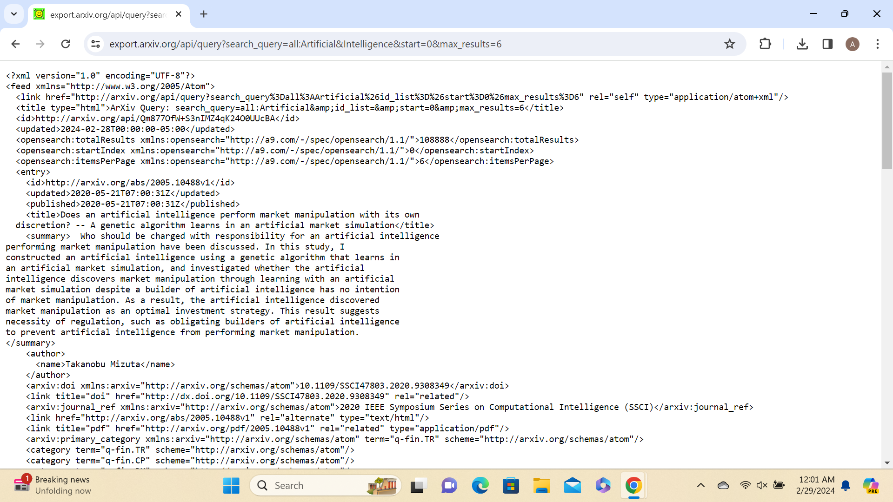

# Junior Seminar (CMPSC 580) Exemplar Project Repository

## Semester: Spring 2024

## GitHub Handle: audreyblarr

## Name: Audrey Blarr

## Major: INFM

## Capital in Terms of Metadata: A Framework Derived and Supported with Data Scraping 

---

## Overview

Metadata, described as "data about data", is utilized in the world of data and information by archives, libraries, and even large language models to collect and organize large amounts of data for purposes of comparison and analysis. However, it's typically assumed by data users that the development and provision of metadata is of high value, with little-to-no interrogation of exactly how the data is supplied or how it's attached to the records derived by the user. The idea of "metadata capital" has been implemented by data researchers Greenberg, Swauger, and Feinstein as a method of inspecting the value and consistency associated with metadata use based on certain "capital" concepts. The Dryad research repository is the focus of their research, where they ensure metadata quality and increase the discoverability of said data, verifying that it's "accessible, organized, intelligible, and complete to ensure ease of re-use" ("What we do"). Despite Greenberg’s efforts to advance the phrase “metadata capital”, it remains unclear the basis in which metadata analysis can be developed to add value, or capital, to its framework. It’s also important to note that her research is from over a decade ago, which proves to be a bit outdated. As applied to metadata, the idea of "capital" is somewhat underdeveloped; "capital" is an interdisciplinary term typically used to describe a set of information's apparent "value proposition", yet there isn't enough literature to support the claims of this proposition. Because knowledge organization is extremely economically beneficial, this study proposes three main problem statements to fill the gaps in existing research on the topic of "metadata capital": curating a consistent and cross-disciplinary definition of the word "capital" as it's applied to metadata, determining frameworks/practices that demonstrate this definition in a desirable fashion, and providing characteristics of a high "metadata capital" repository as well as how users/organizations can benefit from these repositories. To assist in answering these questions efficiently, an experiment will be conducted within this study involving data scraping of the arXiv information repository. To the returned metadata from the scraping, a developed framework of "capital" notions will be applied to specific selection criteria to investigate the extent to which the criteria is consistent to the metadata.

## Literature Review

Greenberg and her research colleagues Feinstein and Swauger were among the first to coin the term “metadata capital” in 2013-14 through their analysis of the Dryad information repository. They highlight the fact that although metadata is extremely crucial for both people and machines to find, access, and utilize information, the effectiveness of metadata can be limited by challenges such as quality, cost, and standards (Greenberg et al.). Once good quality metadata is proven to be practically and beneficially reusable, the original net value of the metadata increases, promoting this concept of metadata capital. Greenberg, Feinstein, and Swauger define “capital” as commonly being an economic concept: a “topic of focus in business and operations literature that applies to impacts (net gains or losses) specific to finances, goods and services, and public needs” (Greenberg et al.). They also recognize the ability of “capital” to be utilized in other notions, such as intellectual capital (aiding profit through individual/organizational knowledge) and social capital (productive and beneficial social relationships), with the commonality between these notions being that a result or phenomenon has a specific value that has the potential of increasing over time. Because metadata capital is a product derived from both human and machine processes, and viewed as a public good, the term can fit each of the notions described, creating a great amount of opportunity for an increase of metadata capital once metadata reuse is aligned with life-cycle management of digital resources. The value of metadata increases once savings and growth are enabled through its reuse, enabling resource savings in time, labor, and financial means. Within the limitations of their study, Greenberg, Feinstein, and Swauger recognize the risk, in addition to the innovation, of coining the idea of metadata capital, as it utilizes a concept from a separate field of study and places it in the context of another. They also are upfront about the early stages of their work, meaning a full analysis of metadata quality, or cost-noting formulas, isn’t present as means of supporting their research.

Greenberg went on to publish more research articles utilizing the concept of metadata capital, pointing out in a separate resource that although metadata reuse adds value to the initial metadata cost, demonstrating a greater return on investment, cost and value aren’t always in alignment with each other (Greenberg). The cost of a product may not be entirely reflective of its worth, which can be combated by extending the term “capital” in this sense to include intellectual and social capital as well as financial, as mentioned previously. Originally published in the Bulletin of the Association for Information Science and Technology, Greenberg defines “metadata capital” keeping the flexibility of the term “capital” in mind. The four different definitions she provides are as follows:

" 1. An asset that contains contextual knowledge about content.  
a. Content is the data or information contained in any information object (any “entity, form, or mode”).  
b. Context is who, what, where, when, how, why, etc., which can be captured via metadata attributes (Kunze, 2001).  
2. A product or service generated by human labor and/or machine-driven processes with value that increases over time or that enables the value increase of other assets.  
3. A good (a service facilitator) supporting a range of functions such as discovery, provenance tracking, rights management, authentication, preservation and other functions associated with lifecycle management and access.  
4. A public good if the product (metadata) is open, following which the services can be open. ”

Keeping these definitions in mind, Greenberg recognizes the biggest challenge with metadata valuation as the task of substantiating value. Although costs can be identified or estimated while pursuing metadata capital as a financial notion, it’s not an easy feat to determine where to begin measuring cost. Cost may start with the design of the metadata system, the builder of the system’s salary, the team implementing the workflow design, or the cost of the code library allowing this system to be built (Greenberg). Evaluating the value of metadata in social and intellectual terms adds even more complexity to the matter, as it’s difficult to determine long-term consequences of metadata that may lead to discoveries several years from now.

As Greenberg’s study of metadata capital involved analysis of the Dryad data repository, this study will utilize the arXiv repository and its API technology. Hosted on arXiv.org, hundreds of thousands of e-prints can be accessed programmatically through arXiv’s API (“arXiv API User's Manual - arXiv info”). Beginners can access these articles through their web browser by visiting arXiv.org and browsing article listings through the links provided, or searching for specific articles by keyword(s) through a search box in the upper right hand corner of the webpage. The API is used in the exact same way as the human web interface, incorporating shortcuts to make searching by query simpler for a user. Instead of opening the web and manually searching for a [keyword], the same results can be viewed by entering in a slightly different url using this format:

http://export.arxiv.org/api/{method_name}?{parameters} (base url)  
http://export.arxiv.org/api/{query}?{search_query=all:keyword} (specific to search queries, where {keyword} is replaced with the keyword being searched for)

The results of the search query will look different using the API than they would on the web interface because the API returns its results in a format called Atom 1.0 rather than HTML. Furthermore, the parameters can be altered to better suit the purpose of the data search. As ‘method_name=query’, the query interface can be changed from ‘search_query’ to ‘id_list’, ‘start’, or ‘max_results’ to produce results better pertaining to the purpose of the API utilization. While ‘id_list’ produces a comma-delimited list of arXiv id’s, parameters ‘start’ and ‘max_value’ can be incorporated to download chunks of the result set at a time rather than downloading all the information at once. To further refine queries, parameter ‘sortBy’ can sort the result list by many different notions, including ‘relevance’, ‘lastUpdatedDate’, or ‘submittedDate’ to produce results pertaining more to present-time research. The ‘sortOrder’ can also be modified to sort the order of the results as either ‘ascending’ or ‘descending’. 

## Methods

As mentioned, this case study will be focused around the utilization of data derived from arXiv. This information repository participates in the Open Archives Initiative (OAI), updating its data-provider nightly with metadata from new submissions. In order to perform data scraping on metadata from arXiv's OAI-PMH interface, one must abide by the rules stated in the Terms of Use for arXiv APIs ("Terms of Use for arXiv APIs - arXiv info.") to prevent restriction of access for their organization. The main limitation to the process of data scraping using arXiv is the rate limit, applying to all of one's devices as a collective:

"When using the legacy APIs (including OAI-PMH, RSS, and the arXiv API), make no more than one request every three seconds, and limit requests to a single connection at a time."

The website also offers rules of guidance to abide by: processes you "can (and should!)" and "must not" follow while data scraping. Processes encouraged by arXiv that will be actively performed in this study include retrieving and using both descriptive metadata and content from arXiv e-prints. Links will also be provided to guide readers to the metadata used and analyzed within this research, per recommendation of arXiv. These actions will partake following the "must not do" list as well, meaning there will be no arXiv e-prints stored on the server, no inaccurate claims of arXiv's endorsement, and no fraudulent credentials to access the APIs.

Keeping all of these guidelines in mind, arXiv queries will be constructed using the base url mentioned above (http://export.arxiv.org/api/{method_name}?{parameters}), which will be altered to include parameters specific to the information being explored. As arXiv’s API has ‘method_name = query’, ‘parameters’ will begin with ‘search_query={prefix}:{keyword}’, where {keyword} will include words and/or phrases to be searched for, and {prefix} will include the field in which the search is conducted. This will prompt arXiv’s API to perform a search query of all the data archives where the keyword(s) are flagged in the specified field (‘ti’=Title, ‘all’=all fields, ‘abs’=Abstract, etc.). In addition to the ‘search_query’ parameter and separated with ‘&’ symbols, ‘start’ and ‘max_results’ will be incorporated so only a few articles are listed at a time in the output. Next, ‘sortBy’, equated to values of either ‘relevance’ and ‘lastUpdatedDate’, are tagged onto the previous parameters to ensure the information being provided as output is the most recent and relevant to the study as possible. The ‘sortOrder’ parameter will then be included, equated to either ‘ascending’ or ‘descending’. A ‘sortBy’ of ‘relevance’ will be paired with a ‘sortOrder’ or ‘ascending’ to sort the resulting output by most to least relevant. In contrast, a ‘sortBy’ of ‘lastUpdatedDate’ will pair with a ‘sortOrder’ of ‘descending’ so the output can be sorted by most to least recent.

The experiment will rely on the definition of metadata capital provided by Greenberg and mentioned above, as well as an initial framework for applying notions of capital based on her definition. The framework relies on the resulting metadata being informing, reliable, and updated/reproduced. Each query being tested will rely on the use of different parameters to examine how altering the query impacts the data being produced by the API. The purpose of this data scraping is to test if arXiv exhibits the characteristics of a high metadata capital repository, and to analyze whether or not arXiv’s metadata is increasing in capital, or can be implemented further to be appreciating in value.

## Using the Artifact

The first query to be explored will search arXiv’s API for the keyphrase ‘Artificial Intelligence’ inside the ‘all’ field. ‘All’ will prompt the API to search for articles with ‘Artificial Intelligence’ included in any given field, including the title, author, abstract, comment, journal reference, subject category, and report number fields ("Terms of Use for arXiv APIs - arXiv info."). Through this research, the keyphrase will be kept constant to explore how different parameters impact the results produced as the keyphrase remains the same. To serve as another constant, the ‘start’ parameter will be ‘0’ and the ‘max_results’ parameter will be ‘5’, so only the first six articles produced with each query will be analyzed. Based on these constant values, the initial query will look like the following:

https://export.arxiv.org/api/query?search_query=all:Artificial&Intelligence&start=0&max_results=6 

Here is an excerpt of the output after running this query, screenshotted and downloaded to the 'data' repository as a png:

For organizational purposes, the information derived from running the queries will be sorted into a spreadsheet. Each query’s spreadsheet will contain headings ‘ID’, ‘Updated’, ‘Published’, ‘Short Title’, ‘Summary Present?’, and ‘# of Authors’ as means of storing information from each resulting article to be analyzed in conjunction with one another. These spreadsheets are then downloaded to the 'data' repository as csv files for proper viewing. The first spreadsheet can be seen below:

The most surprising element of this output is the fact that none of the articles produced had been updated since their publish, each reigning 'published' and 'updated' values identical to each other, which displays lack of collaboration, review since publish, and further implementation. Each title of the outputted articles contains the keyphrase 'Artificial Intelligence', so it's assumable that they query was accurate in searching for metadata relevant to these words. Each source only has three or less authors/contributors.

The next query being studied will incorporate the ‘sortBy’ and ‘sortOrder’ parameters. The metadata produced will be sorted by sortBy=’lastUpdatedDate’ with sortOrder=’descending’ to sort the articles by the date they were last updated, from the most recently updated to the least recently updated. The inclusion of these parameters serves to test whether sorting the results by their last updated date will change the capital of the metadata being produced. The query is represented in the url below:

https://export.arxiv.org/api/query?search_query=all:Artificial&Intelligence&start=0&max_results=6&sortBy=relevance&sortOrder=descending 

Take a look as the second query is ran and sorted into a spreadsheet:

The second query gave more favorable results in some aspects of its output. For starters, more articles produced had been updated since their publication, as two out of six articles are on their second version, with one being on its fourth. Furthermore, there are far more contributors to each article in this query than the last, with each article having 3+ contributors and one even having 20 different authors. Although this metadata proves to have further collaboration and increased implementation, displaying reusability and accuracy of the data, the titles of each article don't seem to relate directly to Artificial Intelligence, and instead describing a similar field or a different topic entirely. This shows a lack on consistency between the two queries presented thus far, despite both being searched using the same keyphrase.

The third and final query will switch the values of ‘search_query’, ‘sortBy’, and ‘sortOrder’ parameters. To try and improve the relatability of the articles with the keyphrase being searched for, ‘search_query=ti’ will be applied so the titles of each outputted article must contain the phrase ‘Artificial Intelligence’. Next, instead of searching according to the last updated date of the articles, the sortBy parameter will now equate ‘relevance’ to search pertaining to the relevance of the article in present times. The sortOrder will also be changed to ‘ascending’, so the results are sorted from most to least relevant. Here is the constructed query according to these alterations:

https://export.arxiv.org/api/query?search_query=ti:Artificial&Intelligence&start=0&max_results=6&sortBy=relevance&sortOrder=ascending 

 Once again, an excerpt of the query’s output as well as a sorted spreadsheet will be produced:

With this final query, the same notions of reusability and implementation to improve the information are displayed with the outputted metadata, as three out of the six are on their second versions of publication. Three out of six of the articles also have more than one contributor, showing increased collaboration on the sources produced. The problem here lies in the titles of the articles produced. While prompting the query be searched in the 'title' field, each title of the rendered articles seems to contain the first half of the keyphrase, "Artificial", but only one includes the word "Intelligence" following it. This proves to be inaccurate towards the overall goal of searching for articles with "Artificial Intelligence" in the title.

## Results and Outcomes

The utilization of three search queries with a constant keyphrase of "Artificial Intelligence" concludes the unfortunate existence of inconsistencies within arXiv's API system. As some categories of information regarding the metadata showed improvement with the inclusion of parameter alterations, there were still challenges posed in each search that could ultimately be improved. arXiv's metadata proves to have some capital in the sense that many articles were further implemented after their initial publication, and collaborated on by many, the accuracy of the metadata and the ability for the queries to produce desirable information definitely fluctuated. arXiv's API fits the notions of reusability and collaboration while discussing metadata capital, but lacks slightly in the accuracy department. To increase accuracy of the results produced, it's recommended that arXiv increases suitability with search queries containing a phrase rather than one word. It should also be explained further in arXiv's API user manual exactly how these parameters impact the results shown. It's unclear what sorting information by "relevance" means to the API, so further elaboration on that concept is also necessary.

## References

“arXiv API User's Manual - arXiv info.” About arXiv, https://info.arxiv.org/help/api/user-manual.html#_preface. Accessed 1 March 2024. 
Greenberg, Jane, et al. “Metadata Capital in a Data Repository.” Proceedings of the International Conference on Dublin Core and Metadata Applications, 2013, pp. 140-160. Semantic Scholar, https://www.semanticscholar.org/paper/Metadata-Capital-in-a-Data-Repository-Greenberg-Swauger/94575d2f7729bc4c9e038200e3c985f1d6469696. Accessed 1 March 2024 
Greenberg, Jane. “Big Metadata, Smart Metadata, and Metadata Capital: Toward Greater Synergy Between Data Science and Metadata.” Journal of Data and Information Science, vol. 2, no. 3, 2017, pp. 19-36. sciendo, https://sciendo.com/article/10.1515/jdis-2017-0012. Accessed 1 March 2024. 
“Terms of Use for arXiv APIs - arXiv info.” About arXiv, https://info.arxiv.org/help/api/tou.html. Accessed 1 March 2024. 
“What we do.” Dryad, https://datadryad.org/stash/mission#our-curation-and-publication-process. Accessed 1 March 2024.

---

## Exemplar Projects Discussions

The department's project descriptions can be found at [https://github.com/ReadyResearchers-2023-24/cmpsc-580-exemplar-projects](https://github.com/ReadyResearchers-2023-24/cmpsc-580-exemplar-projects)

## Schedule

The schedule for this work can be found at [https://github.com/CMPSC-580-Allegheny-College-Spring-2024/classDocs?tab=readme-ov-file#schedule](https://github.com/CMPSC-580-Allegheny-College-Spring-2024/classDocs?tab=readme-ov-file#schedule)
